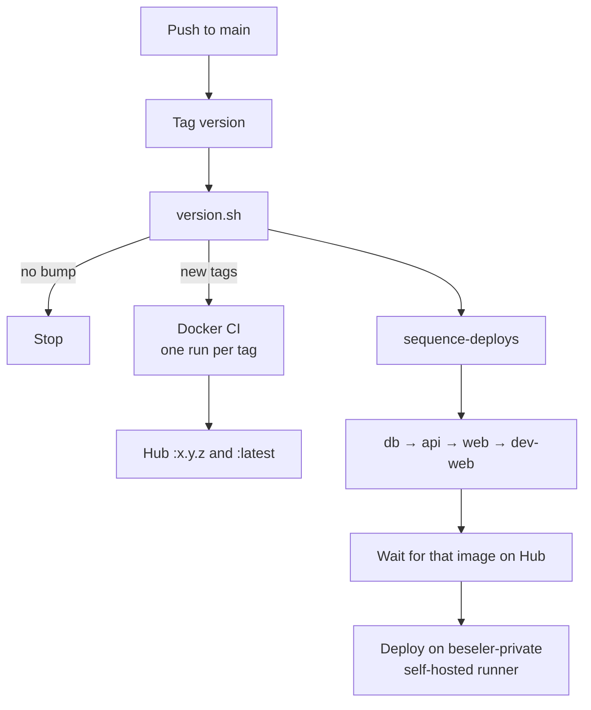

# beseler.sites

Personal sites and the API behind them. Local development is Aspire. Production is versioned Docker images on a homelab Kubernetes cluster.

- [beseler.dev](https://beseler.dev) — personal site (`BeselerDev.Web`)
- [beseler.net](https://beseler.net) — web app (`BeselerNet.Web`) and API (`BeselerNet.Api`)

.NET 10. Solution: `src/Beseler.slnx`.

## Projects

| Project | Role |
|---|---|
| `Beseler.AppHost` | Aspire host (Postgres, Redis, ratchet, the apps) |
| `BeselerDev.Web` | Static personal site |
| `BeselerNet.Web` | Blazor Server app |
| `BeselerNet.Api` | HTTP API (accounts, budget, mail) |
| `BeselerNet.Shared` | Shared contracts |
| `Beseler.ServiceDefaults` | Logging, health, OpenTelemetry |
| `Beseler.Console` | Local helper (not shipped) |
| `data/` | Postgres schema for ratchet |

Images on Docker Hub:

- `abeseler/beseler-dev-web`
- `abeseler/beseler-net-web`
- `abeseler/beseler-net-api`
- `abeseler/beseler-net-dbdeploy` — [ratchet](https://github.com/abeseler/ratchet) plus the files in `data/`

## Local

Need the .NET 10 SDK and Docker (Postgres, Redis, ratchet).

```bash
dotnet run --project src/Beseler.AppHost
```

Or open `src/Beseler.slnx` and launch the AppHost. Aspire starts Postgres and Redis, runs ratchet against `data/` (image bind-mounted), then the API (waits for migrations), the net web app, and the personal site.

Set the `AzureCommunicationService` parameter if you exercise email locally.

## Database

Object folders under `data/` with a `ratchet.json` starting file. One file per table; migration blocks live in that file.

```bash
docker run --rm -v ./data:/app/Migrations abeseler/ratchet validate
```

`validate` is file-only (no database). Production applies the stamped `beseler-net-dbdeploy` image as a Kubernetes Job.

## Releases

Each shipping unit has its own version. A commit is not a release unless that number moves.

| Unit | Version lives in | Git tag | Image |
|---|---|---|---|
| API | `BeselerNet.Api.csproj` `<Version>` | `beseler-net-api-v1.2.3` | `abeseler/beseler-net-api:1.2.3` |
| Net web | `BeselerNet.Web.csproj` | `beseler-net-web-v1.2.3` | `abeseler/beseler-net-web:1.2.3` |
| Dev web | `BeselerDev.Web.csproj` | `beseler-dev-web-v1.2.3` | `abeseler/beseler-dev-web:1.2.3` |
| Database | `data/VERSION` | `beseler-net-dbdeploy-v1.2.3` | `abeseler/beseler-net-dbdeploy:1.2.3` |

Bump the shipping project, not Shared or ServiceDefaults. If Shared changes and you want it in prod, bump API (and anything else that should ship).

`version.sh` tags a component only when its version is newer than that component’s latest tag. It does not bump the project for you.

## Pipeline

Work is on `main`. Push → tag if a version changed → build that image → deploy in a fixed order.



1. **Tag version** (`.github/workflows/tag-version.yml`) — build, `ratchet validate`, `version.sh`. README / LICENSE / editorconfig / gitattributes pushes are ignored.
2. Each new tag starts **Docker CI** (`.github/workflows/docker-ci.yml`) — one image, tags `x.y.z` and `latest`. Builds may run in parallel. This job does not deploy.
3. The same Tag version run then **sequences deploys** into [beseler-private](https://github.com/abeseler/beseler-private): **db → api → web → dev-web**. Each step waits for the image on Hub, then runs that repo’s **Deploy** workflow (`kubectl set image`, or a Job for dbdeploy).

If only web was bumped, db and api are skipped. If db and api were bumped, api does not deploy until the db Job succeeds.

Both workflows can still be started by hand (Tag version with `apply=false` only prints versions).

Secrets on this repo:

- `DOCKER_USERNAME` / `DOCKER_PASSWORD` — push to Hub and inspect tags
- `VERSION_TAGGING_TOKEN` — PAT with Contents write on **this** repo so a tag push can start Docker CI (`GITHUB_TOKEN` cannot)
- `DEPLOY_DISPATCH_TOKEN` — PAT with Actions write + Contents read on **beseler-private** to dispatch and watch Deploy

Manual deploy (any tag already on Hub): **beseler-private → Actions → Deploy**.

## License

See [LICENSE](LICENSE).
